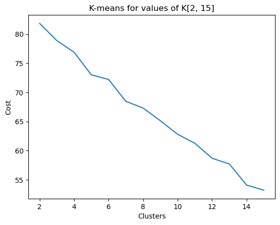

# nonsense-sentiment-scraper

## Crawling, Clustering and Sentiment Analysis on Targeted Subdomains

> NOTE: this project was conceived and implemented for a school project on web search, indexing and retrieval and thus the targeted subdomain was `https://www.concordia.ca/ginacody.html/`

This project is written entirely in Python. The project is subdivided into three distinct parts: web crawling, clustering, and sentimental analysis. Each part builds on the previous part’s output. This allows a user to run the whole project as a single pipeline from start to finish.

### Subproject 1a: Web crawling using the Scrapy module

The Scrapy module (https://scrapy.org/) was used for extracting and following URL links through the www.concordia.ca tree. Scrapy was chosen due to the extensive available documentation as well as the number of existing users, suggesting more support if problems arose during its implementation. The main implementation is located in the `src/scraper/gc_spider.py` file and has two main functions: given the start URL, https://www.concordia.ca/ginacody.html/, collect, follow and store visited URLs in the `output/urls.json` file to be used later. The `GinaCodySpider` class which is enclosed is a child class of the `scrapy.CrawlSpider` module. It includes rules to stay within the `concordia.ca` site, while avoiding all French webpages within the `concordia.ca` subdomain, since we will be clustering on English documents only. Visited URLs are stored as a set, so duplicate URLs are not saved.

#### Robot exclusion with robots.txt and robot metatags

Scrapy is prepackaged with a robot exclusion middleware, which is automatically enabled through the `OVERRIDE_SETTINGS` in the module as `ROBOTSTXT_OBEY = True`. However, this is not enough in our case as the `concordia.ca` subdomain does not have a `concordia.ca/robots.txt `subdomain, but rather, each page has their own `<meta name= “robots”>` tag. Thus, I included a function that checks if the page contains a robot metatag and if so, if it is marked as `“noindex”` or `“nofollow”`. If a page is marked as `noindex` or `nofollow`, that page is not stored in `output/urls.json` and will not be crawled.

#### Setting upper bound crawl-limits

This module sets a maximum crawl limit at 100000 pages with the built-in `CLOSESPIDER_PAGECOUNT` setting. However, the user defines the upper bound crawl limit when running the program by setting the environmental variable `CRAWL_LIMIT`, which should be less than the `CLOSESPIDER_PAGECOUNT` limit. I set a default `CRAWL_LIMIT` to 100 visited URLs. Once the set of visited URLs reaches the crawl limit, the crawler ends and stores the visited URLs as a list.

### Subproject 1b: Extracting the text using the BeautifulSoup module

Extracting the text was done using the BeautifulSoup module (https://www.crummy.com/software/BeautifulSoup/bs4/doc/). This implementation is located in the `src/scraper/extractor.py` file. It takes the stored visited URLs list from the previous module and extracts the relevant text from the corresponding webpage, after cleaning. Here, I decided to take as raw text only the title of the header and the body text, as other fields may result in less precise results later down the pipeline, especially in the clustering and sentiment analysis steps. The raw text was subsequently stored in the `output/raw_text.json` file as a key-value mapping with the URL as the key, and the raw text as the value.

### Subproject 2: Clustering with the Scikit-Learn module

Located in the `src/clustering/clustering.py` module, the main purpose is to vectorize the raw text into TF-IDF values using the `TfIdfVectorizer`, then taking the vectorized TF-IDF vectors and clustering using the KMeans algorithm. The user provides the number of clusters to use. The KMeans module is initialized with a random seed of 0 for repeatability and sets the iteration steps to 100 so that the algorithm can find local loss minimums. Finally, statistics are generated, with the cluster label mapped to the top 20 terms of the cluster. This is an example of the output in the `output/kmeans_{n}_clusters.json`, with `n` representing the number of clusters:

```json
{
    "cluster_0": [
        "concordia",
        "university",
        "engineering",
        "science",
        "computer",
        "school",
        ..
        ],
    "cluster_1": [
        "urban",
        "surface",
        "design",
        "thesis",
        "mrfd",
        ..
}
```

Finally, each document was labeled with its corresponding cluster and stored for later use.

#### Side-project finding the optimal number of clusters using the loss function

As a side-project, in the `src/clustering/evaluate_optimal_clusters.ipynb` Jupyter notebook, I sought to determine the optimum number of clusters given the documents. As observed in the following graph, the loss decreases as the number of clusters increase, but there is an evident “kink” in the graph at `n=5`, suggesting that 5 may be one optimal clustering number. However, one should take this with a grain of salt since the loss range is between 50 and 85, with loss decreasing linearly as clusters increase. This notebook can be run individually from the rest of the project.



### Subproject 3: Generating sentiment analysis with the AFINN module

Using the labeled text documents from Subproject 2, AFINN scores were generated using
the `src/sentiment/sentiment_analysis.py` module. This module accomplishes two things: generates a sentiment score with AFINN for each document, and then computing the cluster AFINN score by taking the average AFINN score for the documents corresponding to each cluster. It does this by first summing the total AFINN score for each cluster, keeping count of the number of documents in each cluster, then taking the arithmetic mean. Finally the average AFINN score, along with the clusters, are stored in the `output/avg_afinn_n_clusters.json`, with `n = number of clusters`. They are stored in the following format:

```json
{
  "cluster_0": {
    "avg_score": 23.390625,
    "count": 64,
    "top_terms": [
      "concordia",
      "university",
      "engineering",
      "science",
      "computer",
      "school",
      "montreal",
      "ev",
      "cody",
      "gina",
      "research",
      "qc",
      "nordic",
      "h3g",
      "canada",
      "software",
      "ca",
      "program",
      "students",
      "security"
    ]
  },
  "cluster_1": {
    "avg_score": 31.76923076923077,
    "count": 26,
    "top_terms": [
      "urban",
      "surface",
      "design",
      "thesis",
      "mrfd",
      "model",
      "knowledge",
      "preparation",
      "dynamic",
      "cities",
      "university",
      "based",
      "proposed",
      "mrfds",
      "concordia",
      "noma",
      "cognitive",
      "fca",
      "research",
      "grit"
    ]
  },
  "cluster_2": {
    "avg_score": -12.0,
    "count": 10,
    "top_terms": [
      "black",
      "racism",
      "task",
      "1969",
      "force",
      "anti",
      "university",
      "report",
      "george",
      "sir",
      "williams",
      "community",
      "leon",
      "jacobs",
      "concordia",
      "time",
      "president",
      "students",
      "sgwu",
      "recommendations"
    ]
  }
}
```

We observe that cluster 0 has a theme of “university information”, cluster 1 has a theme of “technology and innovation”, and cluster 2 has a theme of “social issues”. You may notice that the average cluster AFINN scores are also widely different, with cluster 0 and 1 having positive scores, with cluster 1 having slightly more positive sentiment, while cluster 2 is negative, suggesting negative sentiment overall. You will notice as the number of clusters increase to a certain point, the precision of each cluster will also increase, with more closely-related documents belonging to the same cluster.

## Learning points

The main takeaway from this project is that clustering documents relies on somewhat
intimate knowledge of the existing underlying data, and furthermore, it requires optimization of the number of clusters needed, which can only be determined experimentally since the data is unsupervised.
